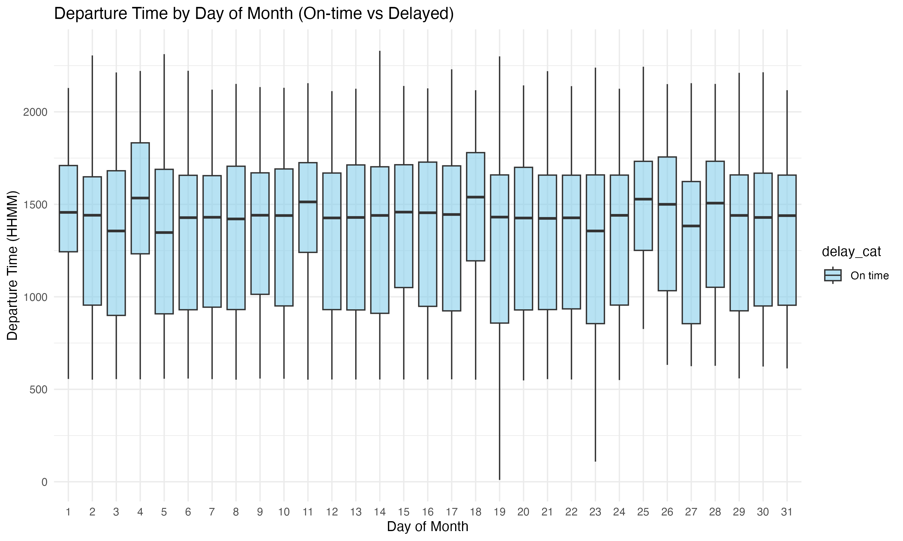
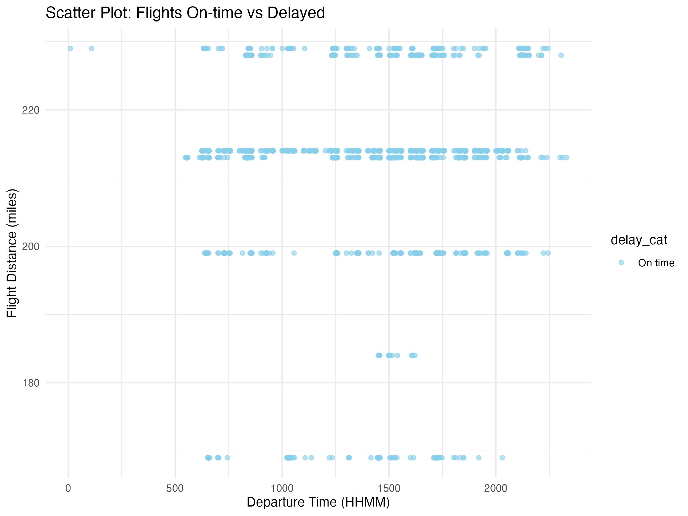

---
title: "✈️ Flight Delays – Exploratory Data Analysis in R"
author: "Gaurav Sharma"
date: "`r Sys.Date()`"
output: word_document
---

# Objective
Analyze a flight delays dataset to understand how departure time, weather, carriers, and distance affect delays.

# Tools Used
- R  
- ggplot2  
- dplyr  
- psych  

# Process
- Imported & cleaned dataset  
- Checked missing values  
- Summarized descriptive statistics  
- Plotted histograms, bar plots, scatter plots, box plots, and pie chart  
- Defined departure hours (0–23)  
- Built categorical tables (delay vs weather, carrier, day of week)  
- Redefined delay variables  

# Key Insights
- 🌅 Morning flights are more punctual than evening ones  
- 🌦️ Bad weather strongly increases delays  
- 🏢 Certain carriers show higher delay rates  
- 📊 About XX% of flights were delayed overall  

# Visuals
  
  
  
  

# Conclusion
This project strengthened my skills in **data cleaning, descriptive statistics, visualization, and storytelling with R**.

